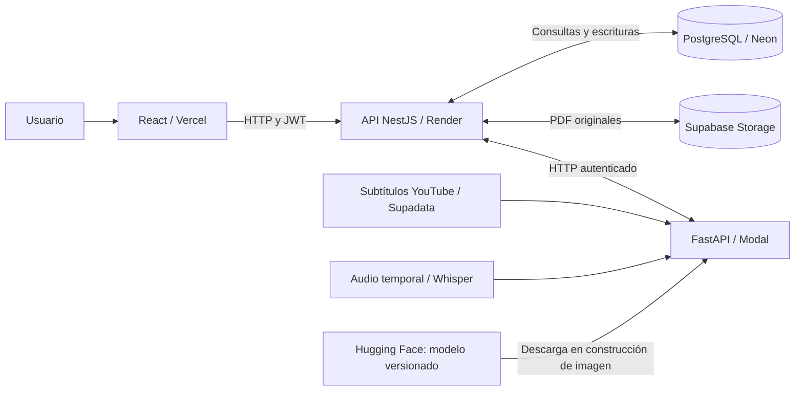
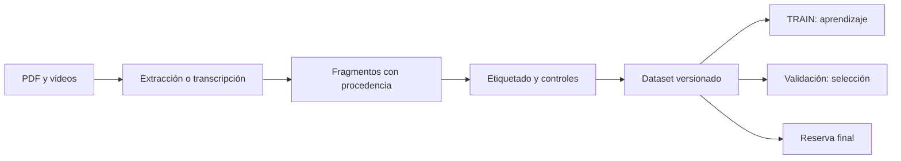

# Historia Viva Perú: informe de avance

**Autora:** Jaqueline Ramos · **Curso:** Machine Learning I · **Fecha:** 13 de septiembre de 2026

Este informe presenta la aplicación, su arquitectura, el dataset, el entrenamiento y las pruebas registradas. Distingue resultados experimentales, configuración implementada y verificación de producción. El término «final» del archivo identifica esta entrega documental; el proyecto continúa en desarrollo.

## 1. Application overview and operation

Historia Viva Perú helps teachers and students explore evidence about Peruvian independence and early republican history (1780–1842). It processes YouTube videos and text-based PDFs into segments linked to their original timestamp or page.

Users add a source, start processing and inspect the resulting segments. BETO predicts a topic for each text. Users can consult the original source and review the suggested category. Reviews are stored separately from predictions and can contribute to a future dataset; they do not immediately retrain the active model.

The **Explore** page presents approved video examples and supports new processing requests. YouTube hosts and plays the video; the application stores its reference, metadata and processed text. A displayed reviewed category does not necessarily mean that a BETO prediction was recorded for that segment.

| Topic | Purpose |
|---|---|
| Colonial context and background | Identify conditions preceding independence. |
| Crisis and emancipatory ideas | Identify debates, legitimacy crises and independence ideas. |
| Social and regional participation | Represent the role of social groups and regions. |
| Military campaigns and conflicts | Distinguish expeditions, battles and military actions. |
| Leadership, diplomacy and political projects | Identify leaders, negotiations and political proposals. |
| Republican organization and consequences | Identify institutional development and its consequences. |
| Not relevant | Avoid forcing unrelated passages into a historical topic. |

These categories cover complementary dimensions of the process. Each segment receives one category according to its dominant argument. People, places and years are separate metadata. Model confidence describes a prediction score; it does not establish historical correctness.

## 2. Arquitectura de software y flujo de servicios

La arquitectura separa la interfaz, la lógica de negocio, el procesamiento ML y la persistencia. La API ejecutada en Render recibe las solicitudes del frontend y realiza consultas o escrituras en PostgreSQL, alojado en Neon.

| Servicio | Responsabilidad |
|---|---|
| Vercel | Publicar la interfaz React y TypeScript. |
| Render | Ejecutar NestJS: autenticación, permisos, cuotas y coordinación de trabajos. |
| Neon | Conservar usuarios, proyectos, fuentes, segmentos, predicciones, revisiones y estados de procesamiento. pgvector almacena vectores para recuperación semántica. |
| Supabase Storage | Conservar los PDF originales mediante almacenamiento compatible con S3. Neon conserva sus registros y referencias de ubicación. |
| Modal | Ejecutar FastAPI, extracción, transcripción y clasificación con BETO. |
| Hugging Face Hub | Distribuir pesos, tokenizador y configuración identificados por una revisión y hashes. |
| Supadata | Recuperar subtítulos existentes en el modo nativo utilizado por el proyecto. |

La API llama a endpoints de Modal, como `/youtube/inspect`, `/transcribe`, `/segment` e `/infer`, mediante credenciales del servidor. Separar ML permite gestionar sus dependencias Python y necesidades de memoria de forma independiente. La configuración de inferencia utiliza **2 CPU y 8192 MiB**, sin GPU; el entrenamiento sí utilizó GPU.

El modelo se descarga desde una revisión fijada de Hugging Face al construir la imagen de Modal, se comprueba su integridad y se ejecuta allí. No se consulta Hugging Face en cada predicción. Para YouTube se intentan subtítulos directos y Supadata; si es necesario, el flujo puede recurrir a audio temporal y Whisper. **Whisper transcribe; BETO clasifica.**

La disponibilidad de capas gratuitas o créditos durante el desarrollo contribuyó a elegir los proveedores. Estas opciones tienen límites y no implican capacidad ilimitada ni gratuidad permanente.

### Persistencia de Explorar

| Tabla del esquema `tfm_schema` | Contenido relevante |
|---|---|
| `resources` | Identificación, título, URL y estado de la fuente. |
| `resource_segments` | Texto, localizadores, etiqueta sugerida, confianza y etiqueta revisada. |
| `labels_taxonomy` | Identificadores y nombres de categorías. |
| `public_processing_requests` | Etapa y seguimiento de la solicitud. |
| `public_processing_attempts` | Registro utilizado para cuotas de procesamiento. |
| `resource_processing_runs` | Trabajos pendientes, en ejecución o finalizados. |

Los videos completos permanecen en YouTube y se muestran mediante su reproductor integrado. Los PDF sí se conservan en Storage. Una sugerencia nula en `resource_segments` significa que **no hay una predicción registrada en ese campo**; no permite deducir por sí sola la causa. La interfaz puede mostrar una etiqueta revisada porque da prioridad a esa clasificación.

## 3. Dataset y procedencia

La unidad de aprendizaje es un **fragmento de texto con una etiqueta**, no un documento o video completo. El corpus se construyó mediante recopilación de fuentes, extracción o transcripción, segmentación, etiquetado asistido por IA y controles de procedencia y duplicación. Los identificadores, localizadores y hashes permiten rastrear y versionar los ejemplos.

| Etapa | Entrenamiento | Validación | Test o reserva |
|---|---:|---:|---|
| Snapshot académico: 814 fragmentos, diez fuentes | 596 | 81 | Test: 137 |
| R2 seleccionado | **1016** | **V: 444** | S permanece cerrada |

El snapshot académico contiene 670 fragmentos PDF y 144 de YouTube. R2 utiliza **590 del corpus histórico H + 426 del lote denominado T300**. El nombre del lote no representa su recuento final. Las cifras de versiones posteriores no deben mezclarse con las métricas de R2.

Se controló la separación por fuente y familia documental para reducir fugas entre aprendizaje y evaluación. Las etiquetas y revisiones asistidas por IA constituyen la referencia disponible, **no un gold experto ni una certificación de corrección histórica**. El protocolo de evaluación sin experto contempla acuerdo, estabilidad, evidencia e invariancia, distinguiendo lo planificado de lo ejecutado.

## 4. Modelo, características y entrenamiento

**BETO** es un modelo basado en BERT, de arquitectura Transformer, preentrenado en español. Se eligió por el idioma del corpus, sus representaciones contextuales y la posibilidad de adaptar conocimiento lingüístico previo con un dataset acotado. Se utiliza `dccuchile/bert-base-spanish-wwm-cased`, con una cabeza de clasificación de siete salidas. Su elección no garantiza superioridad sobre modelos más simples. [Ficha oficial del modelo](https://huggingface.co/dccuchile/bert-base-spanish-wwm-cased).

La tarea es **clasificación supervisada multiclase de una sola etiqueta**. Las características son representaciones numéricas del texto: el tokenizador produce identificadores de subpalabras y una máscara de atención; BETO aprende representaciones contextuales durante el ajuste fino. Fuente, familia y hash son metadatos de trazabilidad, no entradas textuales añadidas automáticamente.

| Propiedad | Configuración |
|---|---|
| Arquitectura | 12 capas Transformer, 12 cabezas de atención por capa |
| Representación interna | 768 dimensiones |
| Vocabulario | 31 002 tokens |
| Entrada R2 | Hasta 384 tokens, con truncamiento y padding |
| Salida | Una de siete categorías y confianza derivada de softmax |

El *fine-tuning* ajusta el codificador y el clasificador. Cada lote produce predicciones; la entropía cruzada ponderada compara estas con las etiquetas y AdamW actualiza los pesos mediante gradientes. La ponderación inversa de frecuencias de TRAIN reduce el dominio de clases abundantes. **La pérdida guía el aprendizaje; F1 macro selecciona el checkpoint.**

El baseline TF-IDF utiliza palabras y bigramas, hasta 50 000 características y regresión logística balanceada. Su vocabulario se ajusta únicamente con entrenamiento.

## 5. Hiperparámetros y selección experimental

La búsqueda académica comparó tasas de aprendizaje y seleccionó por F1 macro de validación:

| Tasa BETO | Mejor época | F1 macro validación |
|---|---:|---:|
| 0,00001 | 2 | 0,34239 |
| **0,00002** | **2** | **0,43766** |
| 0,00003 | 3 | 0,36327 |

Ese ganador obtuvo **0,31066 en el test académico**, frente a **0,36300** de TF-IDF seleccionado con C=4; permaneció experimental. Sus datos y su límite de 192 tokens corresponden a esa etapa, no a R2.

Posteriormente se compararon las siguientes recetas sobre **V444, con semilla 42**:

| Receta | Ejemplos TRAIN | Tasa | Épocas ejecutadas | Checkpoint elegido | F1 macro V |
|---|---:|---:|---:|---:|---:|
| R0 | 590 | 0,00002 | 4 | 4 | 0,37611 |
| R1 | 1016 | 0,00002 | 4 | 4 | 0,51038 |
| **R2** | **1016** | **0,00002** | **20** | **8** | **0,53239** |
| R3 | 1016 | 0,00001 | 20 | 17 | 0,51933 |

R2 fue el mejor de esta comparación. La incorporación del lote adicional mejoró el resultado observado; prolongar el entrenamiento permitió encontrar un checkpoint mejor. Reducir la tasa en R3 no lo superó. R0 frente a R2 cambia tanto datos como duración, por lo que no aísla un único efecto.

| Configuración R2 | Valor y finalidad |
|---|---|
| Microbatch / acumulación | 2 / 8; batch efectivo nominal 16 para limitar memoria |
| AdamW / weight decay | Optimizador y regularización 0,01 |
| Warmup / scheduler | 10 % de pasos de calentamiento y descenso lineal posterior |
| Recorte de gradiente | Norma máxima 1,0 |
| Precisión mixta | AMP float16 |
| Semilla del paquete | 42 |

Estos valores se documentan como configuración; **no todos fueron optimizados individualmente**. R2/42 se ejecutó en una RTX 3050 Laptop y registró aproximadamente 25,8 minutos. La época 8 superó a la última: F1 0,53239 frente a 0,53101 en la época 20.

## 6. Métricas y resultados

**Precisión** mide coincidencias entre las predicciones de una clase; **recall**, cuántas referencias de esa clase se recuperan. **F1** es su media armónica y **F1 macro** promedia los siete F1 con igual peso. **Accuracy** mide coincidencias totales. La confianza de una predicción individual no sustituye estas métricas ni está demostrada como probabilidad calibrada de acierto.

| Categoría — R2/42 en V444 | Precisión | Recall | F1 |
|---|---:|---:|---:|
| Campañas y conflictos militares | 0,7460 | 0,7460 | 0,7460 |
| Contexto colonial y antecedentes | 0,3415 | 0,6087 | 0,4375 |
| Crisis e ideas emancipadoras | 0,7368 | 0,3733 | 0,4956 |
| Liderazgos, diplomacia y proyectos | 0,3333 | 0,4688 | 0,3896 |
| No relevante | 0,8221 | 0,7976 | 0,8097 |
| Organización y consecuencias republicanas | 0,3393 | 0,8261 | 0,4810 |
| Participación social y regional | 0,4737 | 0,3000 | 0,3673 |

El checkpoint seleccionado obtuvo **F1 macro 0,53239** y **accuracy 0,61937: 275 coincidencias de 444**. Organización republicana muestra recall alto y precisión baja: recupera referencias, pero incorpora muchos falsos positivos. F1 macro da igual peso a cada clase y hace visibles las dificultades de las minoritarias.

Las réplicas R2 con semillas 42, 43 y 44 registraron F1 medio **0,52461**, con desviación estándar muestral **0,00845**. La meta interna de 0,70 no se alcanzó. V se utilizó para selección y desarrollo; estos resultados no son una evaluación final independiente. Experimentos posteriores no se promovieron automáticamente por mejorar una cifra agregada.

## 7. Despliegue, mantenimiento e integración continua

El manifiesto selecciona `Jaqueline98/historia-viva-beto-r2-42`, revisión `31a3887ee6906c6778a4853bc76df7b7e2198282`. La publicación conserva pesos, tokenizador y hashes verificables. Este documento no vuelve a certificar qué revisión atiende solicitudes remotas.

GitHub Actions implementa tests y compilaciones. El despliegue de Modal se activa tras CI exitoso en `main`, utiliza el código comprobado y verifica la identidad del servicio y del modelo. Render está configurado para esperar checks. Existe un smoke de producción manual y programado. La existencia de workflows no demuestra el éxito de su última ejecución.

Los trabajos persisten en PostgreSQL; las revisiones pueden alimentar un nuevo snapshot y un entrenamiento posterior controlado. **Una corrección en la interfaz no reentrena ni sustituye automáticamente el modelo.** El retorno a una versión anterior está documentado; no se declara rollback automático.

La versión local incorpora login JWT para Explorar y sus operaciones de procesamiento, cuotas y controles de admisión. El catálogo aprobado mantiene endpoints públicos. Las últimas modificaciones de autenticación y confianza constan probadas localmente, con publicación pendiente según la memoria. No se realizaron pruebas de carga ni se garantiza disponibilidad frente a bloqueos de YouTube.

## 8. Pruebas de funcionamiento registradas

Se reutiliza evidencia existente; no se ejecutaron nuevas pruebas remotas para esta entrega.

| Prueba y entorno | Acción y resultado esperado | Resultado registrado y alcance |
|---|---|---|
| Autenticación ML — local | Solicitar inferencia sin token; esperar HTTP 401. | Aprobada. Comprueba rechazo del acceso en ese entorno. |
| Inferencia BETO real — local | Cargar el candidato académico y enviar dos textos; esperar HTTP 200, categoría y confianza. | Aprobada. Comprueba ejecución con pesos reales, no F1 ni el despliegue R2. |
| PDF y persistencia — recorrido API | Subir PDF sintético de tres páginas, procesar y confirmar una etiqueta; comprobarla en una sesión nueva. | Extracción aprobada; clasificación falló inicialmente por ausencia de modelo activo. Tras reintento se obtuvieron predicciones y persistió la confirmación. No prueba corrección de una etiqueta errónea ni interacción visual. |
| Abstención — producción, 7 de septiembre | Consultar sobre Apolo 11 e Independencia; esperar abstención y evidencias vacías. | Aprobada dentro de seis checks registrados. No certifica el estado remoto actual. |

## 9. Evidencias del proyecto

| Contenido | Archivo |
|---|---|
| Aplicación publicada | [Explorar](https://historia-viva-peru-tfm-web.vercel.app/explorar) |
| Fuentes: títulos, instituciones y URL | [Registro de fuentes](artifacts/beto-v3/source-registry.json) |
| Registro documental y estados de adquisición | [Fuentes anteriores](artifacts/beto-v2/corpus/source-registry-v2.csv) |
| Textos, etiquetas y procedencia utilizados en R2 | [H: 590 ejemplos](outputs/beto-v3/datasets/H.json) · [T300: 426 ejemplos](outputs/beto-v3/datasets/T300.json) |
| Criterios de clasificación | [Guía de etiquetado](docs/beto-v3/guia-etiquetado-v3.1.md) |
| Identidad de los datos y recetas | [Congelado](artifacts/beto-v3/phase-c-freeze.json) · [Protocolo](artifacts/beto-v3/protocol.json) |
| Programa de entrenamiento | [Runner R0–R3](scripts/run_beto_phase_c_v3.py) |
| Métricas y checkpoints | [Resultado R2/42](outputs/beto-v3/phase-c/seed-42/R2/result.json) · [Comparación y réplicas](artifacts/beto-v3/phase-d/comparison.json) |
| Modelo seleccionado | [Manifiesto de producción](configs/production-model.json) |
| Automatización | [CI](.github/workflows/ci.yml) · [Despliegue Modal](.github/workflows/modal-deploy.yml) · [Smoke](.github/workflows/production-smoke.yml) |
| Pruebas locales ML | [Autenticación e inferencia](artifacts/experiments/course-u1/evidence/model-functional.json) |
| PDF y persistencia | [Resultado con recuperación](artifacts/experiments/course-u1/evidence/source-flow-reviewed.json) |
| Pruebas remotas históricas | [Smoke de producción](artifacts/experiments/course-u1/evidence/production-smoke-post-push.json) |
| Metodología de evaluación | [Evaluación sin experto](docs/aprendizaje/evaluacion-sin-experto.md) |
| Desarrollo completo y limitaciones | [Informe técnico detallado](docs/aprendizaje/informe-aplicacion-entrenamiento-produccion.md) |

Los archivos de `outputs` son evidencia local y algunos se excluyen de Git; sus enlaces requieren conservarlos junto al proyecto. El registro de fuentes incluye diferentes estados: la inclusión efectiva en R2 se acredita con los datasets congelados, no solo con la presencia de una URL en un registro.
