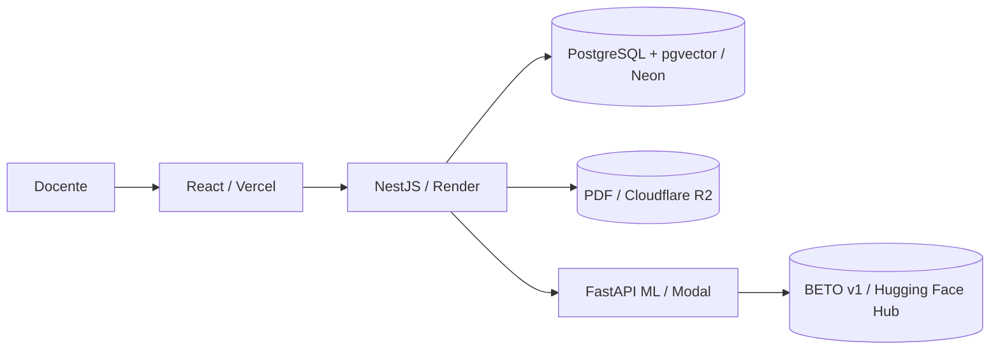

# Historia Viva Perú

Asistente docente para convertir videos de YouTube y documentos PDF en evidencia
histórica navegable sobre la Independencia y la formación republicana del Perú
(1780–1842).

El núcleo del producto es:

```text
Fuente → extracción/transcripción → segmentos → entidades → tema BETO → corrección docente
```

BETO funciona detrás de la interfaz. El docente no configura épocas, batch size ni
datasets: añade una fuente, espera su procesamiento y revisa fragmentos con página
o minuto, subtema, confianza, años, personajes y lugares.

## Problema y propuesta de valor

Buscar una explicación concreta dentro de un video largo o un libro consume tiempo
y dificulta citar la evidencia. Historia Viva Perú permite encontrar un fragmento,
comprender su subtema y abrir la fuente en el punto exacto sin recorrerla completa.

## Flujo docente

1. Inicia sesión y elige un proyecto.
2. En **Fuentes**, añade una URL de YouTube o un PDF con texto seleccionable.
3. La aplicación transcribe o extrae el texto y crea segmentos localizados.
4. Cada tarjeta muestra un subtítulo temático sugerido, confianza, años,
   personajes y lugares.
5. En **Revisión**, confirma, corrige, marca ambiguo o excluye el segmento.
6. En **Buscar**, consulta evidencia y abre el minuto o la página original.
7. Las correcciones quedan como feedback para un snapshot posterior; nunca
   modifican automáticamente el modelo activo.

## Funcionalidades implementadas

- Proyectos y permisos por usuario.
- YouTube de hasta dos horas, con subtítulos y fallback a Whisper.
- PDF textual de hasta 50 MB/500 páginas en local; 10 MB en la demo gratuita.
- Segmentos navegables por timestamp o página.
- Limpieza de PDF y preservación del texto original para auditoría.
- Extracción de años por reglas y de personas/lugares con NER y alias históricos.
- Clasificación temática BETO con confianza visible.
- Revisión individual y masiva, filtros y paginación.
- Snapshots inmutables con split agrupado por fuente.
- Búsqueda textual, semántica y temática con citas.
- Abstención cuando no existe respaldo suficiente.
- Publicación curada, retirada inmediata y auditoría.
- Procesamiento versionado que conserva la extracción anterior si falla.

## Taxonomía

1. `contexto_colonial_antecedentes`
2. `crisis_ideas_emancipadoras`
3. `participacion_social_regional`
4. `campanias_conflictos_militares`
5. `liderazgos_diplomacia_proyectos`
6. `organizacion_consecuencias_republicanas`
7. `no_relevante`

Años, personajes y lugares son entidades independientes, no clases temáticas.

## Datos y resultados reales

| Evidencia | Resultado |
|---|---:|
| Fuentes procesadas | 11 |
| Segmentos totales | 1,577 |
| Segmentos revisados/dataset | 814 |
| Ejemplos mínimos por clase | 100 |
| Fuentes compartidas entre train y test | 0 |
| F1 macro TF-IDF + regresión logística | 0.353 |
| F1 macro BETO v1 | 0.425 |
| Cohen's Kappa | 0.651 |

BETO supera el baseline TF-IDF, pero no alcanza el umbral fijado de F1 macro 0.70.
Por ello se publica como **experimental**, no como modelo robusto o recomendado.
El etiquetado y la segunda validación fueron asistidos por IA; no participó un
historiador independiente. Esta es una limitación metodológica explícita del TFM.

## Arquitectura



- Frontend: React 19, TypeScript, Vite, TanStack Query.
- API: NestJS, TypeORM, JWT y trabajos recuperables en PostgreSQL.
- Datos: PostgreSQL + `pgvector`.
- ML: FastAPI, Transformers, BETO, embeddings y Whisper.
- Local: Docker Compose, almacenamiento de archivos y Redis/BullMQ.
- Demo gratuita: Vercel, Render, Neon, Cloudflare R2, Hugging Face Hub y Modal.

## Ejecución local

Requisitos: Docker Desktop. Node 22 y Python 3.11 solo son necesarios para
ejecutar servicios fuera de Docker.

```bash
docker compose up -d --build
```

- Web: `http://localhost:5173`
- API/Swagger: `http://localhost:3000/api/docs`
- ML health: `http://localhost:8000/health`
- Credenciales: `docente` / `tfm2026`

La cuenta `docente` es colaboradora. Para administrar, defina una contraseña
propia en `ADMIN_PASSWORD`; nunca publique esa credencial.

### Desarrollo por servicio

```bash
cd apps/api && npm ci && npm run start:dev
cd apps/web && npm ci --include=optional && npm run dev
cd apps/ml && python -m venv .venv && .venv/Scripts/pip install -r requirements.txt
```

## Entrenamiento reproducible

El notebook [train_beto_colab.ipynb](notebooks/train_beto_colab.ipynb) entrena con
GPU en Colab. El snapshot versionado mantiene una fuente completa en un único
split. El modelo descargado no se versiona en GitHub: se publica en Hugging Face
Hub usando la ficha de [deploy/huggingface-model](deploy/huggingface-model/README.md).

Artefactos académicos relevantes:

- [Dataset source-aware](artifacts/datasets/gold-v1-source-aware.json)
- [Guía de etiquetado](docs/guia-etiquetado-1780-1842.md)
- [Protocolo experimental](docs/protocolo-experimento-tfm.md)
- [Selección del corpus](docs/seleccion-corpus-v1.md)

## Pruebas

```bash
cd apps/api && npm test -- --runInBand && npm run build
cd apps/web && npm run lint && npm run build
cd apps/ml && .venv/Scripts/python -m pytest -q
```

El smoke test público comprueba health, login, acceso al proyecto y la abstención
de la pregunta fuera de alcance “Apolo 11”:

```powershell
./scripts/smoke-deployment.ps1 -ApiUrl https://TU-API.onrender.com
```

## Despliegue gratuito

Siga [docs/despliegue-gratuito.md](docs/despliegue-gratuito.md). `render.yaml`
configura la API y `apps/web/vercel.json` configura el frontend. El modelo se
publica en Hugging Face Hub. Debido a que los Spaces con cómputo requieren un plan
pagado, la demo ejecuta FastAPI con Modal Starter y escala a cero cuando no recibe
solicitudes. Render no conserva archivos: los PDF se almacenan en R2.

## Seguridad y límites de la demo

- CORS se restringe al dominio configurado en `WEB_ORIGIN`.
- Login limitado a cinco fallos por minuto y cliente.
- Cuenta compartida: máximo tres fuentes nuevas y PDF de 10 MB.
- Archivos públicos y segmentos públicos tienen estados independientes.
- Solo segmentos revisados aparecen en búsquedas públicas.
- Los snapshots académicos son inmutables.
- La licencia es opcional en esta demostración académica; procedencia, declaración
  de uso y aprobación curatorial siguen siendo obligatorias para publicar.

## Limitaciones

- Periodo y español limitados a 1780–1842.
- Sin OCR para PDF escaneado en el MVP.
- BETO v1 es experimental (F1 macro 0.425).
- Kappa 0.651 no alcanzó el objetivo 0.70.
- No hubo historiador independiente ni estudio completo con 5–8 docentes.
- Los servicios gratuitos pueden tener arranques en frío y cuotas.
- Publicar sin licencia verificable es un riesgo asumido y documentado para la demo.

## Entregables del TFM

Las URLs se completan después de crear las cuentas y publicar los servicios.

| Entregable | URL / estado |
|---|---|
| GitHub público | `PENDIENTE_URL_GITHUB` |
| Aplicación Vercel | `PENDIENTE_URL_VERCEL` |
| API Render | `PENDIENTE_URL_RENDER` |
| Modelo BETO | [Hugging Face Hub](https://huggingface.co/Jaqueline98/historia-viva-beto-v1) |
| Servicio ML protegido | [Modal](https://jaquelineramosvargas--historia-viva-peru-ml-ml-api.modal.run) |
| Slides | [docs/Historia-Viva-Peru-TFM.pptx](docs/Historia-Viva-Peru-TFM.pptx) |
| Vídeo 7–9 min | `PENDIENTE_URL_VIDEO` |
| Acceso demo | `docente` / `tfm2026` |

No se considera lista la entrega mientras permanezca una URL `PENDIENTE`.

## Autoría

Jaqueline Ramos — Proyecto Final del Máster en Desarrollo con Inteligencia
Artificial, 2026.
