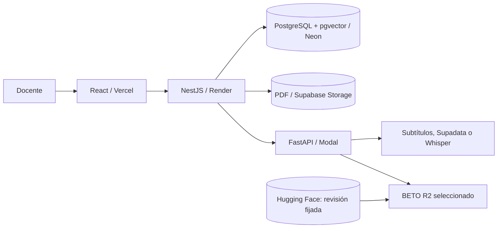

# Historia Viva Perú: funcionamiento, entrenamiento y puesta en producción

Autora del proyecto: Jaqueline Ramos. Corte documental: 12 de septiembre de 2026.

Informe elaborado a partir del código y los resultados conservados en el proyecto. Distingue pruebas históricas, configuración local vigente y comprobaciones documentales de esta entrega. No se ejecutaron nuevos entrenamientos, anotaciones, inferencias ni despliegues para redactarlo. Las referencias entre corchetes remiten a evidencias locales enlazadas al final.

**Resultado principal:** la aplicación implementa un flujo de fuentes históricas, clasificación temática y revisión. Hay pruebas funcionales locales y remotas registradas. El manifiesto de producción selecciona BETO R2/42, época 8, con F1 macro de **0,532392 sobre V de 444 fragmentos**. Esto acredita desempeño de desarrollo frente a la referencia disponible; no certifica corrección histórica ni confirma por sí solo qué versión está atendiendo solicitudes remotas ahora. La meta de F1 macro superior a 0,70 no está demostrada. [E1–E4]

## 1. Funcionamiento de la aplicación

### 1.1. Necesidad que resuelve

Historia Viva Perú ayuda a localizar evidencia sobre la Independencia y la formación republicana del Perú, con alcance 1780–1842. Convierte PDF con texto seleccionable y videos de YouTube en fragmentos que conservan página o minuto de procedencia. El docente puede buscar, consultar la fuente y revisar la clasificación sugerida.

La tarea central de BETO es **clasificación de un fragmento en una de siete clases**, según su argumento dominante. La predicción temática, la extracción de entidades y la recuperación de evidencias son operaciones diferentes. BETO no genera una explicación histórica ni comprueba la veracidad del relato. [E1, E5]

### 1.2. Recorrido de uso

1. Iniciar sesión y elegir un proyecto al que la cuenta tenga acceso.
2. Incorporar un PDF o una URL de YouTube en Fuentes.
3. Procesar la fuente: extracción o transcripción, segmentación y enriquecimiento.
4. Consultar los fragmentos con texto, página/minuto, tema sugerido y confianza.
5. En Revisión, confirmar o cambiar el tema, marcar ambigüedad o excluir. La revisión queda persistida y se distingue de la predicción original.
6. Buscar por texto, similitud semántica o tema y abrir la evidencia localizada. El asistente se abstiene cuando no encuentra respaldo suficiente.
7. Incorporar datos a un snapshot posterior mediante el flujo correspondiente. Revisar una fuente no la incluye automáticamente en el corpus y no actualiza los pesos del modelo.

En el código local actual, Revisión muestra todas las fuentes procesadas, incluidas las candidatas; una campaña es un filtro opcional. Se pagina en grupos de 25 y se solicita orden por menor confianza. La memoria registra que este último ajuste de interfaz tiene lint y compilación aprobados, pero aún no una comprobación visual o remota de esa versión. [E5, E6]

### 1.3. Qué hace cada componente

| Componente | Función comprobable en el proyecto |
|---|---|
| React, TypeScript, Vite y TanStack Query | Interfaz, consultas a API, filtros y operaciones de revisión. |
| NestJS y TypeORM | Autenticación JWT, permisos, proyectos, fuentes, trabajos, revisiones, snapshots y búsqueda. |
| PostgreSQL y pgvector | Persistencia y vectores para recuperación semántica. |
| FastAPI | Extracción PDF, transcripción, segmentación, entidades, embeddings e inferencia temática. |
| BETO ajustado | Asigna una de siete categorías al texto. |
| MiniLM multilingüe configurado | Produce embeddings de 384 dimensiones para búsqueda. Estos 384 valores no son los 384 tokens máximos de BETO. |
| NER en español y reglas | Personas/lugares y años; son metadatos separados de las clases temáticas. |
| Almacenamiento S3 compatible | Guarda PDF de manera persistente fuera del disco efímero de la API. |



Para YouTube, se intenta extraer subtítulos; Supadata es una alternativa ante bloqueos y la API puede recurrir al audio con yt-dlp y Whisper. El servicio usa por defecto Whisper small en CPU/int8. En el recorrido de fuentes, la API solicita ventanas de 75 segundos y solapamiento cero. Esta duración se expresa en segundos y es independiente del límite de tokens del clasificador. Un PDF escaneado sin capa textual queda fuera del OCR del MVP. [E5, E7]

La inferencia recibe una lista de textos, tokeniza con truncamiento y padding, ejecuta BETO en modo evaluación sin gradientes y aplica softmax. Devuelve etiqueta y confianza redondeada a cuatro decimales. Una confianza de 0,80 no demuestra una probabilidad de acierto históricamente calibrada. Los errores de extracción pueden propagarse a entidades, búsqueda y clasificación. [E7]

## 2. Dataset: unidad, versiones y procedencia

### 2.1. Qué es un ejemplo

Un ejemplo es un fragmento, no un libro ni un video completo. Incluye texto y etiqueta de referencia; según la versión, también ID, fuente, familia documental, localizador, estado de revisión y hash. El modelo aprende del texto tokenizado y de la etiqueta. La fuente y el hash permiten trazabilidad y separación de conjuntos; no son características textuales añadidas automáticamente a BETO.

Una familia documental agrupa materiales relacionados. Separar solo párrafos al azar puede dejar señales de la misma obra en entrenamiento y evaluación. Por eso se documentan divisiones por fuente y, en experimentos posteriores, por familia o componente. Un componente conservador de procedencia tampoco debe confundirse con una independencia histórica certificada.

### 2.2. Versiones que deben presentarse por separado

| Versión / experimento | Entrenamiento | Selección / evaluación | Interpretación |
|---|---:|---|---|
| Snapshot académico v1 | 596 | Validación 81; test 137 | Total 814, diez fuentes; base de los experimentos del curso. |
| BETO R2 | 1016 = H histórico 590 + T300 426 | V 444; S cerrada | R2 es una receta. T300 es un nombre histórico, no el recuento actual del lote. |
| Fases H e I | 1095 = 1016 + 79 | V 444 | H añade datos; I cambia ponderación sobre los mismos 1095. |
| Referencia v3.2, control AMP y familia | 746 | DEV 160 y retrospectiva 160 separada | Nueva partición y referencias; no comparar directamente su F1 con V444. |
| Baseline Colab preparado | 758 = 746 + 12 | DEV 160 | Entrega para tres semillas; el README no acredita entrenamiento completo en Colab ni métricas nuevas. |

El archivo `train-corregido.jsonl` abierto fuera del repositorio en el IDE no basta para identificar el dataset del modelo publicado. Esta entrega no verificó sus bytes ni le atribuye resultados: su correspondencia requeriría el manifiesto y el recibo de la ejecución concreta. [E2, E8–E11]

### 2.3. Distribución del snapshot académico

Snapshot identificado como `9e99a778-7fab-4e29-bd8b-45466c3728dc`, SHA256 `54bd64939cc3bdf4d105d14208a41fd2dbb9095f7ef9cb52a4c3baf083f29ece`. La documentación registra 670 fragmentos PDF y 144 de YouTube. [E8]

| Clase | TRAIN | Validación | Test | Total |
|---|---:|---:|---:|---:|
| Campañas y conflictos militares (MIL) | 89 | 4 | 7 | 100 |
| Contexto colonial y antecedentes (COL) | 70 | 16 | 14 | 100 |
| Crisis e ideas emancipadoras (IDE) | 59 | 15 | 28 | 102 |
| Liderazgos, diplomacia y proyectos (LID) | 93 | 4 | 23 | 120 |
| No relevante (NR) | 101 | 16 | 39 | 156 |
| Organización y consecuencias republicanas (REP) | 101 | 15 | 14 | 130 |
| Participación social y regional (SOC) | 83 | 11 | 12 | 106 |
| **Total** | **596** | **81** | **137** | **814** |

La auditoría guardada registra siete fuentes de entrenamiento, una de validación y dos de test, sin fuentes compartidas ni textos normalizados idénticos entre conjuntos. Los cuatro ejemplos de MIL y cuatro de LID en validación hacen sensible la selección a pocos aciertos. La ausencia de duplicados exactos no garantiza ausencia de paráfrasis ni de dependencias documentales.

### 2.4. Etiquetado y evaluación sin experto

Las etiquetas y su segunda revisión fueron asistidas por IA. El nombre histórico `gold-v1-source-aware.json` no acredita un gold experto. El kappa 0,651 del corte académico mide acuerdo respecto al procedimiento registrado, no exactitud histórica.

La evaluación debe separar tres preguntas: si los anotadores coinciden; si las decisiones son estables y cumplen evidencia/reglas; y si las predicciones del modelo coinciden con la referencia disponible. Ninguna equivale automáticamente a corrección histórica.

El protocolo vigente permite combinar sesiones IA ciegas, repeticiones de estabilidad, pruebas de invariancia, comprobación automática de citas/offsets/reglas y resultados por fuente/familia. Cada procedimiento necesita sus propios denominadores y estado de ejecución: no se declara realizado todo el plan por existir un documento. No hay experto disponible y su intervención no es un requisito ni un bloqueo para cerrar este informe. V permanece congelada y S cerrada. [E12]

## 3. Características, modelo y entrenamiento

### 3.1. Baseline TF-IDF y BETO

El baseline transforma palabras y bigramas en vectores TF-IDF: minúsculas, normalización de acentos, mínimo dos documentos por término, hasta 50 000 características y frecuencia sublineal. Una regresión logística balanceada, con solver lbfgs y máximo 2000 iteraciones, aprende la clasificación. El vocabulario se ajusta únicamente con TRAIN. [E8, E13]

BETO parte de `dccuchile/bert-base-spanish-wwm-cased`, revisión `c4d86612f51b4f46759c8390d1798c2febe71b93`. Reutiliza representaciones contextuales en español y se ajusta con una cabeza de siete salidas. Conserva el tratamiento de mayúsculas y la tokenización del modelo base; no aplica automáticamente el preprocesamiento de TF-IDF.

```text
Texto → subpalabras → IDs y máscara → BETO → 7 logits → softmax → tema sugerido
                                           ↓
Entrenamiento: etiqueta de referencia → pérdida → gradientes → actualización
```

Los parámetros son los pesos aprendidos. Los hiperparámetros son decisiones como tasa de aprendizaje, longitud, épocas o peso de regularización. El F1 evalúa predicciones discretas; la entropía cruzada es la pérdida diferenciable que orienta la actualización. No se optimiza F1 directamente mediante el gradiente de esta implementación.

### 3.2. Optimización académica efectivamente comparada

La búsqueda fue una comparación finita predefinida, no una optimización exhaustiva de todas las combinaciones. Se seleccionó por F1 macro de validación y se guardó la selección antes de evaluar el ganador en test. [E13]

| Modelo | Hiperparámetro comparado | Mejor época | F1 macro validación |
|---|---|---:|---:|
| TF-IDF + regresión logística | C = 0,25 | — | 0,26736 |
| TF-IDF + regresión logística | C = 1 | — | 0,26751 |
| TF-IDF + regresión logística | **C = 4** | — | **0,29004** |
| BETO | lr = 1e-5 | 2 | 0,34239 |
| BETO | **lr = 2e-5** | **2** | **0,43766** |
| BETO | lr = 3e-5 | 3 | 0,36327 |

En regresión logística, un C mayor reduce la regularización. En BETO, lr regula el tamaño de las actualizaciones. La receta académica común usó semilla 42, máximo tres épocas, 192 tokens, microbatch 2, acumulación 8 y batch efectivo 16; AdamW, weight decay 0,01, calentamiento del 10 % y descenso lineal. Se utilizaron precisión mixta y gradient checkpointing para trabajar con la GPU local.

| Evaluación en el test académico de 137 | F1 macro | Decisión registrada |
|---|---:|---|
| Baseline fijo TF-IDF C=1 | 0,35343 | Referencia de comparación. |
| TF-IDF seleccionado C=4 | 0,36300 | Mejor configuración de su búsqueda por validación. |
| BETO académico lr=2e-5, época 2 | 0,31066 | Candidato inferior; no se activó. |
| BETO v1 histórico | 0,42461 | Modelo experimental de referencia histórica. |

El BETO académico ganador de validación fue peor en test. Eso es un resultado negativo documentado y evita presentar una selección como mejora garantizada. El régimen de entrenamiento también difiere de v1; no se atribuye toda diferencia a lr. Este test ya había sido consultado históricamente y no es una evaluación externa nueva. [E8, E13]

### 3.3. Receta R2 seleccionada para publicación

| Parámetro | Valor R2/42 | Propósito |
|---|---|---|
| Datos | H + T300, 1016 fragmentos | Aprender de la condición congelada. |
| Longitud máxima | 384 tokens, incluidos especiales | Fijar el contexto disponible; los excedentes se truncan. |
| Tasa de aprendizaje | 2e-5 | Regular el tamaño del ajuste. |
| Épocas ejecutadas / checkpoint elegido | 20 / época 8 | Elegir el mayor F1 macro de V, no la última época. |
| Microbatch / acumulación / efectivo | 2 / 8 / 16 | Reducir memoria por paso manteniendo acumulación. |
| Optimizador / weight decay | AdamW / 0,01 | Actualización y regularización. |
| Recorte de norma del gradiente | 1,0 | Limitar gradientes grandes. |
| Precisión | AMP float16 | Reducir uso de memoria y cómputo. |
| Scheduler | Calentamiento lineal y descenso lineal | Horizonte nuevo para la trayectoria. |
| Pasos nominales | 64 por época; 1280 en 20; warmup 128 | Derivados del tamaño y la acumulación. |
| Pérdida | Entropía cruzada ponderada por frecuencia inversa de TRAIN | Reducir dominio de clases frecuentes. |
| Normalización | Suma de CE ponderada / suma de pesos del batch efectivo real | Mantener coherencia con acumulación y lote final. |
| Semilla del paquete | 42 | Identificar la trayectoria concreta. |

R0 utilizó H y cuatro épocas; R1 añadió T300 conservando cuatro; R2 mantuvo H+T300 y ejecutó veinte; R3 mantuvo veinte y redujo lr a 1e-5. El diseño permite estudiar cambios concretos; comparar R0 con R2 conjuntamente cambia datos y duración. No demuestra el efecto aislado de un único hiperparámetro. [E2, E14]

La trayectoria R2/42 registra GPU NVIDIA GeForce RTX 3050 Laptop, 1550,455 segundos de ejecución y predicciones idénticas al recargar el checkpoint. El tiempo corresponde a esa trayectoria registrada; no es el coste total del proyecto ni una promesa de duración en Colab.

| Época R2/42 | 1 | 4 | 8 | 9 | 17 | 20 |
|---|---:|---:|---:|---:|---:|---:|
| F1 macro V | 0,279189 | 0,514634 | **0,532392** | 0,531731 | 0,532281 | 0,531010 |

Las réplicas registradas de R2 con semillas 42, 43 y 44 obtuvieron 0,532392, 0,525811 y 0,515615. Media **0,524606**, desviación estándar muestral **0,008453**. R0 tuvo media 0,421345. Estas réplicas describen estabilidad entre semillas en el mismo V; no son tres conjuntos externos independientes. [E2]

### 3.4. Experimentos posteriores y criterio de conservación

| Intervención | Evaluación | Resultado | Decisión registrada |
|---|---|---|---|
| Fase G, contexto | V444 | F1 0,526266 | No supera las puertas; conservar R2. |
| Fase H, incorporación de 79 | V444 | F1 0,547008; solo 2/4 condiciones | Rechazada por retrocesos, aunque suba la media. |
| Fase I, ponderación por familia | V444 | F1 0,515924; 0/4 condiciones | Rechazada; train F1=1 no demostró generalización. |
| Control AMP v3.2 | DEV160 | F1 0,491838, época 5 | Terminó; no alcanzó la meta. |
| Ponderación limitada por familia v3.2 | Mismo DEV160 | F1 0,493735, época 4 | Mejora global no demostrada; no promovida. |

El control AMP v3.2 limita a ocho épocas, con paciencia 2 y min_delta 0,0001 para early stopping; terminó en la séptima y seleccionó la quinta. Emplea 746 TRAIN, 384 tokens, lr 2e-5, batch efectivo 16, horizonte 376 pasos y warmup 37. El scheduler avanza solo tras actualizaciones válidas. El candidato por familia terminó en la sexta época y seleccionó la cuarta. [E9, E10, E15]

Después de las épocas seleccionadas, la pérdida TRAIN continúa bajando mientras F1 DEV empeora y NLL aumenta: patrón compatible con sobreajuste tardío. La diferencia de F1 familia menos control fue +0,001897, con intervalo bootstrap por componente del 95 % [−0,086932; +0,060103]. Incluye cero y ambos signos; no demuestra superioridad ni equivalencia.

La evaluación retrospectiva de AMP registra F1 0,3970 frente a 0,8641 de R2. R2 había estado expuesto al conjunto histórico de origen: **0,8641 no es evidencia de generalización ni demuestra superar la meta**. No se mezcla esa cifra con V444 ni con DEV160.

## 4. Métricas e interpretación

Para una clase, TP son coincidencias positivas con la referencia, FP predicciones de esa clase cuya referencia era otra y FN referencias de la clase que el modelo perdió:

```text
Precisión = TP / (TP + FP)
Recall = TP / (TP + FN)
F1 = 2 TP / (2 TP + FP + FN)
F1 macro = promedio de los siete F1 de clase
Accuracy = coincidencias totales / número de ejemplos
NLL = promedio de −log(probabilidad asignada a la referencia)
```

F1 macro da el mismo peso a cada clase y ayuda a no ocultar dificultades de categorías pequeñas. La matriz de confusión muestra qué categorías se intercambian. NLL examina probabilidades, kappa examina acuerdo y los análisis por fuente/familia examinan heterogeneidad. Son medidas complementarias. La softmax y una NLL menor no bastan para certificar calibración.

### 4.1. R2/42 en V444

| Clase | Precisión | Recall | F1 | Soporte |
|---|---:|---:|---:|---:|
| MIL | 0,7460 | 0,7460 | 0,7460 | 63 |
| COL | 0,3415 | 0,6087 | 0,4375 | 23 |
| IDE | 0,7368 | 0,3733 | 0,4956 | 75 |
| LID | 0,3333 | 0,4688 | 0,3896 | 32 |
| NR | 0,8221 | 0,7976 | 0,8097 | 168 |
| REP | 0,3393 | 0,8261 | 0,4810 | 23 |
| SOC | 0,4737 | 0,3000 | 0,3673 | 60 |

Son **275 coincidencias de 444**, accuracy **0,619369**, frente a F1 macro **0,532392**. No se debe describir F1 como «53,24 % de respuestas correctas». REP recupera 19/23 referencias, pero solo 19/56 predicciones REP coinciden: su recall alto convive con muchos falsos positivos. IDE recupera 28/75; deja escapar buena parte de sus referencias. [E2]

La meta interna de 0,70 no se alcanzó. V fue usado para seleccionar checkpoints e intervenciones, por lo que sus resultados son de desarrollo. Los análisis reutilizados no convierten V en evaluación independiente. La reserva S continúa cerrada; no se le atribuyen resultados.

## 5. Puesta en producción y operación

### 5.1. Distribución y configuración

| Destino configurado | Contenido y configuración relevante |
|---|---|
| Vercel | Frontend en `apps/web`, build Vite y salida `dist`; reescritura de rutas a `index.html`. |
| Render | API Docker, `render.yaml`, despliegue tras checks; liveness `/api/health/live`. |
| Neon | PostgreSQL/pgvector; conexión de API mediante `DATABASE_URL`. |
| Supabase Storage | PDF vía S3; endpoint, bucket y credenciales del lado servidor. |
| Modal | FastAPI con 2 CPU y 8192 MiB configurados; mínimo 0 contenedores, máximo 1 y hasta 4 entradas concurrentes. |
| Hugging Face Hub | Pesos, tokenizador y metadatos de inferencia fijados a revisión inmutable. |

La configuración Modal instala PyTorch CPU y no solicita GPU de inferencia. Separa así GPU de entrenamiento y cómputo del servicio. Tiene timeout de función 1800 s, de arranque 900 s y ventana de apagado 120 s. Son valores del código, no tiempos de respuesta medidos ni garantía de capacidad.

En Render la cola usa `PROCESSING_QUEUE_DRIVER=database` para mantener trabajos en PostgreSQL; Redis/BullMQ queda como opción local. Los PDF no dependen del disco efímero de Render. `/api/health/live` separa vida de la API del diagnóstico combinado de `/api/health`, que puede esperar al arranque de ML. [E16]

La API configura `WEB_ORIGIN`, JWT y credenciales de servicios; ML usa token interno y autenticación proxy Modal. Estos secretos se suministran por entorno y no van en el bundle de Vercel. La cuenta docente conserva cuota demo de tres fuentes; el rol admin validado en la base está exento de esa cuota. Esta excepción no elimina otros límites.

### 5.2. Identidad del modelo seleccionado

El archivo `configs/production-model.json` identifica:

```text
Repositorio: Jaqueline98/historia-viva-beto-r2-42
Revisión:    31a3887ee6906c6778a4853bc76df7b7e2198282
Checkpoint:  R2, semilla 42, época 8
Máximo:      384 tokens
Pesos SHA256:
e964dfbdd6010b205e619a9e7daf6558eb9b6b2a55a1a0c58d3a98b420493303
```

El contrato fija siete hashes y el orden MIL, COL, IDE, LID, NR, REP, SOC. El empaquetado conserva pesos/tokenizador y adapta los metadatos al servicio. Una paridad en cinco textos sintéticos, incluida truncación larga, está registrada: comprueba el empaquetado, no un F1 nuevo. [E3, E4, E17]

La memoria registra publicación de R2 por la autora. El manifiesto confirma su selección local. **Este informe no vuelve a comprobar remotamente la revisión servida.** El README principal todavía menciona v1 en partes: esas frases son anteriores a la selección R2 y no se usan para identificar el paquete vigente.

### 5.3. Secuencia de entrega implementada

1. Preparar el paquete desde un checkpoint conservado y verificar originales, etiquetas, tokenización y paridad.
2. Publicar en Hugging Face; comprobar revisión remota y hashes antes de cambiar la selección local. R2 ya figura seleccionado: no hay motivo documental para repetir su publicación.
3. La autora revisa y gestiona commit/push. El workflow CI ejecuta tests/build de API, lint/build web y tests ML, además de comprobar importación Modal sin desplegar.
4. Render tiene configurado esperar checks. Vercel dispone de receta de build; esa receta por sí sola no acredita la configuración actual del panel ni que espere CI.
5. Tras CI exitoso en main, el workflow Modal toma exactamente el SHA probado y omite uno ya superado por otro commit. Construye la imagen con la revisión y hashes de modelo seleccionados.
6. La comprobación posterior llama health e inferencia y contrasta SHA de código e identidad del modelo. Archiva `outputs/modal-deployment.json` cuando existe.
7. El smoke de producción está configurado para ejecución manual y diaria a las 14:00 UTC; valida salud, acceso, abstención y shell web.

Que un workflow exista no demuestra que su última ejecución haya pasado. Si la verificación posterior falla, Actions queda en rojo y el servicio puede haberse desplegado ya: no hay rollback automático. La recuperación documentada restaura un manifiesto conocido y pasa de nuevo por CI/despliegue. [E17, E18]

### 5.4. Evidencia operativa y límites

El 7 de septiembre se registraron seis checks de producción aprobados. El 12 se documentaron correcciones de construcción/importación Modal y de transcripción. La autora confirmó que YouTube volvió a funcionar; es confirmación de uso para ese caso, no una nueva verificación remota del asistente ni garantía para cualquier video. El ajuste más reciente de Revisión seguía pendiente de publicación según memoria. [E6, E19]

Los planes gratuitos y sus cuotas son parte del diseño registrado, no una cotización vigente. Este informe no consultó precios ni promete operación gratuita ilimitada. El entrenamiento consumido tampoco puede valorarse en moneda a partir de segundos GPU solamente: el ledger conserva límites y campos de coste desconocido. No se consumió presupuesto de entrenamiento/anotación en esta entrega.

Para levantar la configuración local existente, el comando documentado es `docker compose up -d --build`; expone web 5173, API 3000 y ML 8000. No se ejecutó aquí. Reproducir resultados de entrenamiento requiere además datos/artefactos locales, versiones fijadas y recibos: parte del corpus y de los checkpoints se excluye de Git, por lo que clonar el código no equivale a disponer de todos los experimentos. [E1, E20]

## 6. Pruebas de funcionamiento documentadas

Se incluyen cinco casos, de los cuales los primeros tres constan como aprobados en sus entornos registrados. **Son pruebas históricas reutilizadas, no ejecuciones nuevas sobre la versión remota actual.** Se verificaron documentalmente sus archivos y la coherencia de resultados en el recibo adjunto. [E19, E21, E22]

### PF-01. Autenticación del servicio ML

**Precondición:** FastAPI local en proceso con token interno configurado. **Acción:** solicitar predicción sin token. **Esperado:** HTTP 401. **Observado:** caso ML-01 aprobado el 7 de septiembre de 2026. **Qué demuestra:** rechazo del acceso no autorizado en ese entorno. No prueba toda la política de permisos de producción.

### PF-02. Carga e inferencia con BETO real

**Precondición:** candidato académico `beto-lr2e5` disponible localmente. **Acción:** cargarlo y enviar dos frases mediante FastAPI. **Esperado:** carga y respuesta HTTP 200 con etiqueta/confianza por entrada. **Observado:** caso ML-02 aprobado.

| Entrada registrada | Predicción | Confianza |
|---|---|---:|
| San Martín organizó la expedición libertadora del Perú. | MIL | 0,4958 |
| La Constitución estableció la organización política de la nueva república. | REP | 0,3850 |

La prueba usa pesos reales, pero ese candidato no es R2. Verifica ejecución y contrato; dos frases no miden F1 ni corrección histórica del sistema. Como control adicional, ML-03 intentó reemplazar el modelo por uno inexistente: se registró 404 y conservación de predicciones del anterior. [E21]

### PF-03. Abstención ante ausencia de evidencia

**Precondición:** API remota disponible y sesión docente autenticada. **Acción:** consultar la relación de Apolo 11 con la Independencia peruana. **Esperado:** abstención y evidencias vacías. **Observado:** check aprobado el 7 de septiembre, junto a salud API/ML, rechazo de credenciales inválidas, login, acceso al proyecto y shell web; seis de seis aprobados. El check de consulta registró 23,56 s, una observación puntual que no representa latencia típica. **Qué demuestra:** el control de respaldo funcionó en esa prueba, no ausencia universal de respuestas incorrectas. [E19]

### PF-04. PDF, predicciones y persistencia de revisión

**Precondición:** proyecto autenticado y PDF privado sintético de tres páginas. **Acción:** subir, recuperar el archivo, procesar, consultar segmentos, revisar y leer en una sesión nueva. **Esperado:** PDF íntegro, tres segmentos con página y predicción, revisión persistida.

**Observado:** la carga/recuperación y segmentación pasaron; la clasificación inicial falló por ausencia de modelo activo. Tras un reintento posterior se obtuvieron tres predicciones y se persistió la confirmación de NR. El recibo conserva `passed: false` del fallo inicial y `verification_passed_after_retry: true` de la recuperación. Se confió en la etiqueta sugerida; **no se probó corregir una predicción errónea**. Fue un recorrido API, sin comprobación visual. No se cuenta como flujo impecable de extremo a extremo. La fuente sintética debe mantenerse fuera del corpus histórico. [E22]

### PF-05. Integridad del paquete R2

**Precondición:** originales y paquete de inferencia R2 conservados. **Acción registrada:** comparar hashes y ejecutar cinco textos sintéticos en original y paquete. **Esperado:** mismos pesos, tokens y predicciones, incluida entrada larga. **Observado:** paridad aprobada según recibo de empaquetado. **Qué demuestra:** adaptación compatible con inferencia; no acredita disponibilidad remota ni calidad histórica. [E17]

Para una demostración posterior de la versión publicada, se puede utilizar PF-03 y repetir PF-04 registrando SHA, revisión del modelo, tiempos y resultado de cada paso. Si se muestra una corrección de tema, debe cambiarse efectivamente la etiqueta y comprobar su persistencia. Estos son guiones de demostración, no pruebas nuevas declaradas aprobadas ni un requisito experto.

## 7. Qué puede afirmarse en la presentación

«Desarrollé una aplicación que transforma PDF y videos en evidencia histórica localizada, sugiere siete temas con BETO y permite revisar y recuperar fragmentos. Comparé hiperparámetros con F1 macro de validación y conservé resultados negativos. El modelo R2 seleccionado obtuvo F1 macro 0,532392 en 444 fragmentos de desarrollo; no alcanzó la meta de 0,70. Implementé un despliegue distribuido con versiones y hashes y documenté pruebas de autenticación, inferencia, abstención y persistencia, indicando sus entornos e incidencias. Las etiquetas fueron asistidas por IA; el acuerdo no equivale a validación histórica experta».

Esta formulación separa el producto implementado, los resultados experimentales y el grado de verificación operativa. La entrega del informe está completa con la evidencia disponible; no declara cerrada una evaluación final sobre S ni certifica remotamente la versión actual.

## 8. Evidencias locales

| ID | Fuente |
|---|---|
| E1 | [README del producto](../../README.md). |
| E2 | [Comparación R0/R2 y réplicas](../../artifacts/beto-v3/phase-d/comparison.json). |
| E3 | [Manifiesto seleccionado](../../configs/production-model.json). |
| E4 | [Ficha de R2](../../deploy/huggingface-r2/README.md). |
| E5 | [Servicio de recursos](../../apps/api/src/resources/resources.service.ts) y [controlador](../../apps/api/src/resources/resources.controller.ts). |
| E6 | [Revisión en interfaz](../../apps/web/src/pages/ReviewPage.tsx) y [memoria vigente](../../AGENT.md). |
| E7 | [Inferencia BETO](../../apps/ml/app/ml/beto.py) y [configuración ML](../../apps/ml/app/config.py). |
| E8 | [Informe académico histórico](../../coursework/informe-unidad-1.md) y [auditoría del snapshot](../../artifacts/experiments/course-u1/beto/dataset-audit.json). |
| E9 | [Resultado AMP](../../artifacts/beto-v3/reference-v32-amp-ready/execution-result/informe.md). |
| E10 | [Resultado por familia](../../artifacts/beto-v3/reference-v32-family-ready/execution-result/informe.md). |
| E11 | [Guía de versiones/dataset](guia-beto-dataset-pruebas.md) y [Colab preparado](../../artifacts/beto-v3/colab-baseline/README.md). |
| E12 | [Evaluación sin experto](evaluacion-sin-experto.md) e [instrucciones persistentes](../../AGENTS.md). |
| E13 | [Selección BETO](../../artifacts/experiments/course-u1/beto/selection.json), [resultado BETO](../../artifacts/experiments/course-u1/beto/report.json), [selección TF-IDF](../../artifacts/experiments/course-u1/tfidf/selection.json) y [resultado TF-IDF](../../artifacts/experiments/course-u1/tfidf/report.json). |
| E14 | [Protocolo R0–R3](../../artifacts/beto-v3/protocol.json), [runner](../../scripts/run_beto_phase_c_v3.py) y [trayectoria R2/42 local](../../outputs/beto-v3/phase-c/seed-42/R2/result.json). |
| E15 | [Estado de G/H/I](../../artifacts/beto-v3/development-current.json). Es un registro histórico parcial; los bloques posteriores de memoria y sus recibos complementan su estado. |
| E16 | [Render](../../render.yaml), [Vercel](../../apps/web/vercel.json) y [Modal](../../apps/ml/modal_app.py). |
| E17 | [Guía de publicación y rollback](despliegue-modelo-automatico.md) y [recibo local de paridad](../../outputs/model-releases/beto-iba2_1r6-verification.json). |
| E18 | [CI](../../.github/workflows/ci.yml), [despliegue Modal](../../.github/workflows/modal-deploy.yml) y [smoke programado](../../.github/workflows/production-smoke.yml). |
| E19 | [Seis checks de producción](../../artifacts/experiments/course-u1/evidence/production-smoke-post-push.json). |
| E20 | [Alcance de la entrega GitHub](publicacion-github.md) y [ledger vigente](../../artifacts/beto-v3/budget-ledger-current.json). |
| E21 | [Tres casos locales con modelo real](../../artifacts/experiments/course-u1/evidence/model-functional.json). |
| E22 | [PDF y revisión tras reintento](../../artifacts/experiments/course-u1/evidence/source-flow-reviewed.json). |
| E23 | [Verificación documental de esta entrega](../../artifacts/informe-aplicacion/verificacion.json). Distingue estas comprobaciones de las pruebas históricas. |

Las fuentes originales se conservan con sus fechas, incluso cuando un pendiente de un documento antiguo quedó sustituido por una entrada posterior. Para identificar el modelo seleccionado prevalece el manifiesto; para una ejecución prevalece su recibo; para saber qué sirve producción hace falta la verificación remota correspondiente.
